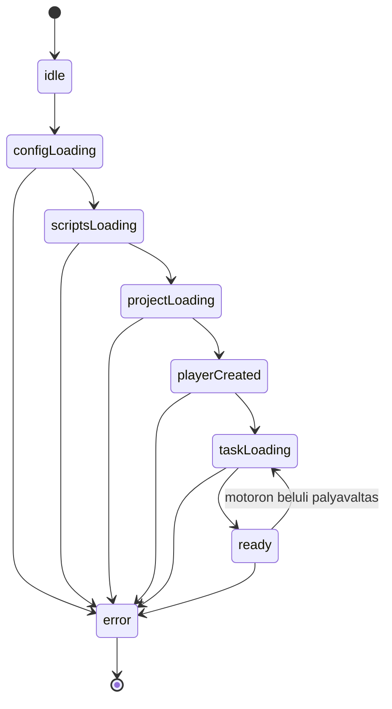

# Parcel POC: iframe nélküli feladatkeret

## Állapot és cél

Ez a dokumentum az első POC specifikációját és a megvalósítás állapotát tartalmazza. **Az első működő keret elkészült.** A futtatási parancsok és ellenőrzési eredmények a [README.md](README.md) elején találhatók. A további fejezetekben megmaradó tervezett lépések nem tekinthetők automatikusan teljesítettnek.

## Megvalósult szerkezet és eltérések

Az új forrásstruktúra feladatonként külön asseteket tartalmaz:

```text
lessons/
  lib/
  1710/
    1710/
    tracksjs/
    images_ms/
shell/
  index.html
  package.json
  package-lock.json
  public/shell-config.json
  src/config.js
  src/lesson-loader.js
  src/readiness.js
  src/layout.js
  src/main.js
  src/shell.css
  src/compatibility.css
  scripts/assets.mjs
  scripts/build.mjs
  scripts/server.mjs
  tests/
  playwright.config.mjs
```

A következő specifikációs részleteket ez a szerződés pontosítja:

- A közös forrás `lessons/lib/`, a feladat belépőscriptje `/lessons/1710/1710/index.js`.
- A `/lessons/1710/lib/` virtuális útvonal a közös könyvtárra mutat. A motor ezen keresztül számolja a feladatonkénti `tracksjs` és `images_ms` helyét, forrásmódosítás nélkül. Statikus buildben ezt feladatonként generált másolat biztosítja.
- A konfigurációvalidáció és URL-képzés egy kis modulban van; az indítás és fullscreen a `main.js` része. A dev és preview ugyanazt a kiszolgálómodult használja.
- A forrásból hiányzó MathJax fájlokat a kompatibilis 2.7.9-es npm-csomag pótolja; az ismert ReDoS-kockázatot a README dokumentálja. Nem történt legacy függőségfrissítés.
- A dev és preview gyökérútvonalú keretet szolgál ki. Külön keret-almappás telepítés még nem implementált; az assetprefix alkönyvtáras értéke viszont böngészőben ellenőrzött.
- A build, öt Node-teszt és az integrált böngészős POC-próbák sikeresek. A teljes CLI Playwright-suite Linux rendszerfüggőségek miatt blokkolt; a teljes pálya-/touch-/fullscreen mátrix még hátralévő ellenőrzés.

Az alábbi eredeti részletes terv modul- és ütemezési listája a további fejlesztési irányokat is tartalmazza; az implementált állapotot a fenti lista és a README rögzíti.

A cél egy Parcel 2 alapú, reszponzív keret, amely azonos originről betölt egy meglévő Okosdoboz-feladatot a saját dokumentumába, iframe nélkül. Egy teljes oldalbetöltés egy aktív feladatot jelenít meg. Másik feladatra teljes oldalnavigációval váltunk; a motoron belüli pályaváltás megmarad.

A konzervatív megközelítés határai:

- A feladatok, a motor és a meglévő függőségek forrása és verziója változatlan.
- Csak az új keretet, betöltőadaptert, kompatibilitási CSS-t és kiszolgálási eszközöket fejlesztjük.
- Nem cserélünk le motorfüggvényeket, nem nullázzuk a motor globális állapotát, és nem indítunk részleges újrainicializálást.
- Nincs iframe, Shadow DOM, SPA-feladatcsere vagy több párhuzamos lejátszó.
- A keret és a kezelősáv reszponzív; a feladattér a motor meglévő arányos skálázását használja.

A „tetszőleges feladat” az itt megismert carco/Okosdoboz csomagolási szerződésnek megfelelő feladatot jelenti, nem tetszőleges idegen HTML-alkalmazást. Jelenleg a 1710-es feladat áll rendelkezésre; más feladatok kompatibilitását további mintákkal kell igazolni.

## Meglévő integrációs pontok

| Forrás | A terv szempontjából fontos működés |
| --- | --- |
| [lessons/1710/1710/index.html](lessons/1710/1710/index.html) | Eredeti indítási sorrend: bootstrap, közös felhasználói konfiguráció, feladatazonosító, majd `loadProjects` és `createPlayer`. |
| [lessons/1710/1710/index.js](lessons/1710/1710/index.js) | Beállítja a `carco.data.okosdoboz.id` értékét. |
| [lessons/lib/okosdoboz.js](lessons/lib/okosdoboz.js) | A bootstrap script `name`, `project`, `lib` attribútumaiból indul; dinamikusan tölt további fájlokat. |
| [lessons/lib/config.js](lessons/lib/config.js) | A konfigurációt és a lejátszót választja; a dokumentum query paraméterei felülírhatnak beállításokat. |
| [lessons/lib/configs/default/config_user.js](lessons/lib/configs/default/config_user.js) | `createPlayer()` az `odPlayer` elembe építkezik, visszaadja a gyökérelemet, és beállítja a `window.drwmsg` referenciát. |
| [lessons/lib/carco_functions.js](lessons/lib/carco_functions.js) | `player.get`, `root.init`, `resizeplayer`, skálázás, aszinkron pályabetöltés és a betöltési réteg kezelése. |
| [lessons/lib/player.css](lessons/lib/player.css) | Fix fejlécek, kezelősáv és túlcsordulást elrejtő konténerek. |
| [lessons/lib/players/default/fullscreenbody.css](lessons/lib/players/default/fullscreenbody.css) | Dokumentumszintű 750 px minimumszélesség és globális stílusok. |
| [lessons/lib/carco_drag.js](lessons/lib/carco_drag.js) | Koordinátakezelés és görgetéskompenzáció; regressziós vizsgálati alap. |

A konfiguráció a bootstrap `lib` útvonalából számítja az assetgyökeret: `hosts[currentHost] + "../"`. A feladatonkénti virtuális `lib` útvonal miatt ez a `/lessons/<ID>/` mappára mutat, ahol a `tracksjs`, `images_ms` és az eredeti `<ID>/` belépőkönyvtár található.

## Könyvtárstruktúra

A meglévő források tartalma változatlan, helyük a kért szerkezetre módosult. A keret a `shell/` könyvtárban található; az alábbi modulfelbontás egy része további tervezett finomítás:

```text
4kids/
  README.md
  parce-poc.md
  lessons/
    lib/                        eredeti motor és függőségek
    1710/
      1710/                     eredeti feladatbelépő és XML-ek
      tracksjs/                 feladatadatok
      images_ms/                feladatképek
  shell/                        új keret
    index.html
    package.json
    package-lock.json
    playwright.config.mjs
    public/
      shell-config.json
    src/
      main.js
      config.js
      urls.js
      lesson-loader.js
      readiness.js
      layout.js
      fullscreen.js
      shell.css
      compatibility.css
    scripts/
      dev-server.mjs
      build.mjs
      preview-server.mjs
      sync-lessons.mjs
    tests/
      config.test.mjs
      urls.test.mjs
      loader.test.mjs
      packaging.test.mjs
      lesson.spec.mjs
    dist/                       generált, nem verziózott
```

A generált `dist`, `.parcel-cache`, `node_modules`, `test-results` és `playwright-report` könyvtárak nem kerülnek Gitbe. A forrásokat nem költöztetjük át, és nem hozunk létre kézzel karbantartott legacy másolatot.

## URL- és prefixszerződés

Az alapértelmezett `lessonsPrefix` értéke `/lessons`. Példa ugyanazon origin alatt:

```text
/?lesson=1710                       az új keret a kiválasztott feladattal
/shell-config.json                  a keret konfigurációja
/lessons/1710/1710/index.js          a feladat azonosítójának scriptje
/lessons/1710/1710/index.html        eredeti, önálló kontrolloldal
/lessons/lib/okosdoboz.js            bootstrap
/lessons/lib/odconfig_user.js        közös felhasználói konfiguráció
/lessons/lib/...                    további változatlan motorfájlok
/lessons/1710/lib/...               virtuális könyvtáralias
/lessons/1710/tracksjs/...           pálya- és feladatadatok
/lessons/1710/images_ms/...          képek
/lessons/1710/images_ms/half/...     félméretű képek
```

**A `/lessons/1710` a feladat forráshelye, nem az új keret útvonala.** A keret csak az ottani `index.js` scriptet tölti be, nem a teljes `index.html` dokumentumot. A feladat eredeti HTML-je a kontrollméréshez elérhető marad.

A prefix lehet például `/content/lessons` is. A keret saját telepítési helye ettől független: `/app/index.html?lesson=1710` is tölthet feladatot `/lessons/1710/` alól. A keret konfigurációját a dokumentum mappájából tölti, nem a Parcel bundle hash-elt URL-jéhez képest.

Minden legacy URL-t egyetlen `urls.js` modul készít `URL` API-val. A bootstrap `lib` attribútuma a normalizált prefixből képzett, záró perjellel rendelkező könyvtár-URL. Nem használunk globális `<base>` elemet.

## Konfiguráció

A tervezett `shell/public/shell-config.json`:

```json
{
  "lessonsPrefix": "/lessons",
  "defaultLessonId": "1710",
  "supportedLessonIds": ["1710"],
  "loadTimeoutMs": 30000
}
```

| Kulcs | Szerződés |
| --- | --- |
| `lessonsPrefix` | Azonos originű, gyökérhez viszonyított útvonal vagy azonos originű abszolút HTTP(S) URL. Normalizált könyvtár-URL lesz belőle. |
| `defaultLessonId` | A queryből hiányzó feladat alapértéke; szerepelnie kell a támogatott listában. |
| `supportedLessonIds` | Nem üres, egyedi, támogatott azonosítók listája. Csomagolási és kompatibilitási manifest, nem biztonsági sandbox. |
| `loadTimeoutMs` | Pozitív egész időkorlát; a POC-ban 1000 és 120000 ms között engedélyezett. |

A feladatválasztás `?lesson=1710` alapján történik, hiányzó paraméternél az alapértékkel. Az ID karakterlánc, 1–12 számjegy, pozitív és vezető nulla nélküli. Üres, duplikált, hibás vagy a manifestből hiányzó ID hibát eredményez a bootstrap előtt. Nem szűkítjük az adaptert egy 1710-re írt feltételre.

A POC csak a `lesson` query kulcsot fogadja el. Az `id`, `config`, `player`, `currentgame`, `currenttrack`, `playersize`, `datatype` és minden más kulcs elutasítandó. A motor is feldolgozza a `window.location.search` értékét; ezzel megakadályozzuk a keret választásának véletlen felülírását. Nem írjuk át észrevétlenül az URL-t History API-val.

Prefixvalidáció még URL-normalizálás előtt is szükséges. Elutasítandó a cross-origin vagy protokollrelatív URL, credentials, query/hash, visszaperjel, pontszegmens, útvonalbejárás és kódolt szeparátor. A POC egyszerű szabályaként a prefixben százalékosan kódolt szegmens sem engedélyezett. A puszta `/` nem használható mountként. A prefixben és a feladatazonosítóban nincs tetszőleges felhasználói script-URL.

A JSON HTTP-hibája, hibás formátuma, ismeretlen kulcsa vagy hiányzó kötelező mezője kontrollált konfigurációs hibát ad. A konfiguráció lekérése `cache: "no-store"` beállítással történik. A build és a kiszolgáló ugyanazokat a validációs szabályokat használja; a same-origin ellenőrzés futáskor a tényleges originhez kötött.

Új feladat hozzáadásakor az eredeti csomagot és kapcsolódó közös asseteket kell elhelyezni, majd a manifestet bővíteni. Ez buildkonfigurációs változás, nem adapterkód-módosítás.

## Modulok és felelősségek

| Tervezett modul | Feladat |
| --- | --- |
| `main.js` | Egyszeri indítás, állapotok és magyar loading/error megjelenítés; a modulok összekapcsolása. |
| `config.js` | Konfigurációs séma, manifest és feladatválasztás validációja. |
| `urls.js` | Prefixnormalizálás, közös és feladatspecifikus asset-URL-ek. |
| `lesson-loader.js` | Klasszikus scriptek szekvenciális betöltése, `loadProjects` és `createPlayer` egyszeri meghívása. |
| `readiness.js` | A motor DOM- és adatállapotának megfigyelése, készültség és időkorlát. |
| `layout.js` | Konténer- és kezelősávmérés, legacy resize-csatorna és magasságkorrekció. |
| `fullscreen.js` | Felhasználói műveletre induló Fullscreen API és fallback. |
| `shell.css` | A keret saját elrendezése és állapotai. |
| `compatibility.css` | Kizárólag a keretoldalra szűkített legacy stílusfelülírások. |

Tervezett adapterfelület: `startLesson({ config, lessonId, container, signal, onState })`, amely egy Promise-ban visszaadja a létrehozott gyökér referenciáját a készültségi feltételek teljesülésekor. Egy oldalon csak egy indítási Promise létezik. Ismételt azonos indítás ezt adja vissza; eltérő feladat újraindítási kísérlete hibát ad.

A megfigyelők saját cleanup művelete leállítja a keret figyelőit és időzítőit. **Ez nem a motor unmountja**, és nem teszi lehetővé egy második runtime indítását.

## Indítási állapotgép



### Bootstrap lépései

1. A dokumentum készültségének és a konfigurációnak ellenőrzése; egyetlen `div#odPlayer` a normál DOM-ban. A body saját `parcel-lesson-shell` osztályt kap.
2. Az `odPlayer` indulás előtt `playersize="embedded"` attribútumot kap. Ez nem új regisztrált lejátszó, csak a meglévő parser által átadott nem-`fullscreen` érték; a viewport-beavatkozást elkerülő ág működését tesztelni kell.
3. A bootstrap betöltése: `src` a prefix alatti `lib/okosdoboz.js`, attribútumok `name="carco"`, `project="okosdoboz"`, `lib` a prefix alatti közös könyvtár. Az attribútumok a DOM-ba helyezés előtt kerülnek a scriptre.
4. Az eredeti sorrendben a `lib/odconfig_user.js`, majd a kiválasztott feladat `index.js` fájljának betöltése. Minden script külön `load`/`error` kezeléssel és időkorláttal fut, nem ESM-importként.
5. A script által beállított `carco.data.okosdoboz.id` egyezésének ellenőrzése a kiválasztott ID-vel; szükséges névterek ellenőrzése.
6. `carco.functions.loadProjects(callback)` pontosan egyszer. A callbackben a `createPlayer()` egyszeri hívása és visszatérési gyökerének megtartása.
7. A keret kompatibilitási stílusának elhelyezése a motor által beszúrt stylesheet-elemek után, majd a fontos computed style értékek ellenőrzése. A betöltés közbeni dokumentumszélességet már a kezdeti, kellően specifikus keret-CSS védi.
8. Layout- és készültségfigyelők indítása. A projektcallback csak strukturális készültség, nem bizonyítja az aszinkron pálya és képek befejezését.

Nem másoljuk át az eredeti `window.onload` hozzárendelést, nem használunk jQuery `.load()`, `innerHTML`-es scriptindítást vagy `eval` hívást. A motor tölti a saját jQuery/CreateJS/MathJax függőségeit; ezeket a keret nem tölti be másodszor.

Az időkorlát a scriptindítástól az első feladat készültségéig tart; későbbi pályaváltás új, ugyanilyen korlátos várakozást kap. Hiba után a későn érkező callback nem indíthat lejátszót és nem változtathatja az állapotot `ready`-re.

## A feladat készültsége

A motor `afterPreload` útvonala létrehozza a feladat gyermekeit, majd időzítve elrejti a `playeritems.preload_layer` elemet. Ez megfigyelhető, de **a betöltési réteg rejtett állapota önmagában nem elég**.

A készültségfigyelő azonnal kiértékeli az állapotot, majd `MutationObserver` segítségével követi a feladat DOM-ját és a betöltési réteget. A feltételek együtt szükségesek:

- Az aktuális játékazonosító a kért feladaté.
- Az aktuális pálya és hozzá tartozó adatok elérhetők.
- A gyökérben a feladat renderelt gyermekei megjelentek.
- A feladattér mérete pozitív.
- A kezdeti betöltés és feladatépítés bizonyítéka mellett a preload réteg rejtett.
- Két egymást követő animation frame-ben stabil, pozitív geometria mérhető.

A megfigyelő ne kizárólag egy később elkapott eseményre várjon: gyors betöltésnél már meglévő adatokat és DOM-ot is ellenőriznie kell. Későbbi pályaváltásnál a motor által megjelenített preload réteg alapján loading állapotba térhet vissza, új `createPlayer` nélkül.

Nem hívjuk újra a `root.carco.load("server", callback)` függvényt csak egy készültségi callbackért, és nem cseréljük le a motor callbackjeit. A canvas tényleges tartalmának és a képek betöltésének helyessége külön böngészős ellenőrzés: a DOM-készültségi jel nem bizonyítja önmagában az összes asset sikerét.

## Reszponzív layout

A motor saját játéktérméretezése megmarad. A teljes lejátszót nem kényszerítjük 7:3 arányra, és nem skálázzuk CSS-transzformációval. A 3150 × 1350-es logikai tér arányos megjelenítéséért továbbra is a motor felel.

A kompatibilitási CSS a `body.parcel-lesson-shell` és az `#odPlayer` alá szűkített. Feladata a dokumentum 750 px-es minimumának feloldása, a szükséges overflow/height szabályok korrigálása, a fejléc és kezelősáv újratördelése, valamint az információs és eredményrétegek elérhetősége. A motor meglévő gombjai és eseménykezelői megmaradnak; nincs külön másolat vagy click-továbbító UI.

### Méretezési ciklus

1. Valódi konténerszélesség-változásnál a keret a meglévő ablak-`resize` csatornát működteti. A motor saját `resizeEnd` pluginja végzi a gyermekek késleltetett átméretezését.
2. A layout-adapter a meglévő `root.carco.resizeplayer` függvényt használhatja a játéktér méretéhez, majd a következő animation frame-ben korrigálja a külső player és szükséges belső wrapper magasságát.
3. A teljes magasság a látható fejlécek, kezelősáv, játéktér, margók és border-box geometriájából készül, nem újabb fix 106 px-es konstansból.
4. A betöltési réteg pozícióját a játéktér és a tényleges pozicionáló ős téglalapjából kell korrigálni; a motor fix 108/51 px-es top feltételezése újratördelt fejlécnél nem elegendő.
5. A magasságot az információs rétegek és pályaváltások után is ellenőrizzük. Magas információs tartalomnál görgetés maradjon lehetséges.

`ResizeObserver` a konténer szélességét és a kezelősávok magasságát figyeli. `requestAnimationFrame` összevonás, újrabelépési védelem és legfeljebb 1 px-es eltérést figyelmen kívül hagyó méretőr szükséges. Saját magasságírás nem indíthat végtelen `resize` sorozatot. A motor késleltetett korrekciója után ismételt, korlátos layout-ellenőrzés szükséges.

Nem feltételezünk `root.carco.resizeEnd()` API-t. A már regisztrált event listener az eredeti függvényreferenciát tartja; a `resizeplayer` property lecserélése nem cserélné le automatikusan a listenert. Ezért a POC nem írja felül a metódust.

**Döntési kapu:** ha a kezelősáv vagy koordináták korrekciója csak motorfüggvények lecserélésével oldható meg, a POC ezt inkompatibilitásként dokumentálja és külön jóváhagyást kér. Nem bővül észrevétlenül motorátírássá.

## Fejlesztői kiszolgálás

Parcel kizárólag a keret HTML-belépési pontját és új moduljait dolgozza fel. Nem követjük Parcel HTML-függőségként a legacy feladat belépési pontját, és nem hash-eljük át a motor dinamikus fájlneveit.

A tervezett `dev-server.mjs` egy origin alá egyesíti a keretet és az asseteket:

- Parcel belső, loopback porton fut, az új keret buildjét készíti.
- A külső fejlesztői szerver például a 3000-es porton érhető el; a port konfigurálható.
- A konfigurációt és a prefix alatti legacy fájlokat közvetlenül szolgálja ki a forrásból.
- A keret HTTP-kéréseit Parcelhez proxyzza, és a HMR WebSocket kapcsolatot is ugyanazon origin alatt kezeli.
- Foglalt portnál érthető hibát ad; nem állít le meglévő folyamatot.

A kiszolgálás bevált statikus middleware-t és proxykönyvtárat használjon helyes MIME- és WebSocket-kezeléssel. Egyedi rész csak a mount-, konfigurációs és indítási logika legyen. A fájlrendszer-hozzáférésnél canonical path/realpath ellenőrzés akadályozza meg a mounton kívüli, symlinkes vagy útvonalbejárásos hozzáférést.

A prefix teljes útvonalszegmens: `/lessonsx` nem `/lessons` alatti kérés. Hiányzó legacy fájl valódi 404-et ad, **nem keret-HTML fallbacket**. Statikus útvonalon csak GET/HEAD támogatott. A feladatkönyvtár eredeti indexoldalára a szokásos directory index/redirect szabály vonatkozik.

Kezdetben a forrásgyökér a meglévő repository. Opcionális `LESSONS_SOURCE_DIR` környezeti változó másik forrásgyökeret jelölhet; ez szerveroldali konfiguráció, nem böngészőből érkező fájlrendszerútvonal.

## Build és éles telepítés

A tervezett buildlépések:

1. Konfiguráció és célútvonalak ellenőrzése.
2. Parcel production build a keret `dist/` könyvtárába.
3. A validált konfiguráció változatlan értékeinek kiírása a keret mellé.
4. A manifestben szereplő teljes feladatmappák, a közös `lib` és a generált feladatonkénti `lib` aliasmásolatok másolása a prefixnek megfelelő outputkönyvtárba. A pályák és képek a feladatmappák részei.
5. Fájllista és SHA-256 ellenőrzés a forrás és a legacy output között.

A másolás strukturált fájlrendszer-API-val történik; nem másolja a teljes repót, `.git` vagy `node_modules` tartalmat. Nem ír a forrásokba, és nem töröl az ellenőrzött outputgyökéren kívül. A MathJax és a képek teljes relatív hierarchiája megmarad.

Gyökérbe telepítésnél például:

```text
shell/dist/
  index.html
  shell-config.json
  assets...                     Parcel által generált keretfájlok
  lessons/
    lib/
    1710/
      1710/
      tracksjs/
      images_ms/
      lib/                      generált aliasmásolat
```

A runtime konfiguráció prefixe és a generált mount helye összetartozik. **A JSON prefixének átírása önmagában nem mozgatja át az asseteket.** Új prefixhez újracsomagolás vagy az éles szerver mountjának átállítása is szükséges.

Almappában telepített keretnél a kiadási gyökér és a keret base path külön konfigurálható: a keret például az output `app/` részébe kerül, míg a `/lessons` továbbra is az origin gyökeréhez kötött outputhely. Az `app/` és a prefix nem fedheti át egymást. Ezt a buildnek és a previewnak azonosan kell kezelnie.

A POC alapértelmezése a kezelt, automatikus legacy másolás. Már meglévő same-origin assetkiszolgálásra később külön, explicit külső-asset mód készülhet; ez nem szükséges az első működő próbához.

Tervezett package script nevek: `dev`, `build`, `preview`, `test`, `test:e2e`. Ezek jelenleg nem futtatható projektparancsok. Parcel, proxy/middleware, ikonkönyvtár és Playwright támogatott verziói az implementációkor, lockfile-lal rögzítendők; csak a keret kap új dependencyket. A Node támogatott LTS verzióját szintén ekkor rögzítjük.

## Hibakezelés, fullscreen és biztonság

A keret magyar loading státuszt és konkrét hibát jelenít meg, `aria-live` állapottal. A hiba szövege `textContent` útján kerül a DOM-ba. Példa hibakategóriák: konfiguráció, ismeretlen feladat, scriptbetöltés, azonosítóeltérés, projektbetöltési időkorlát, feladatkészültségi időkorlát, nem támogatott motorfelület.

Hibás vagy lejárt indítás lezárt állapot. Újrapróbálás csak teljes oldalreload, nem ugyanabban a dokumentumban végzett remount. A keret megszakítja saját fetch-eit és figyelőit; egy script elem eltávolítása nem garantálja a motor összes későbbi kérésének megszakítását. A későn befejeződő callbackeket ezért is védeni kell.

A fullscreen gomb felhasználói kattintásból hívja a `requestFullscreen()` műveletet a teljes feladatos keretre. `fullscreenchange` után layout-frissítés történik. Nem támogatott API-nál kibővített CSS-mód használható, állapotvesztés nélkül. Natív button, megfelelő ikon, tooltip, `aria-label` és látható billentyűfókusz szükséges; nem adunk külön használati útmutatót a feladat képernyőjére.

Ha eredményüzeneteket fogyasztunk, közvetlen mountban `event.source === window` és azonos origin szükséges, típus- és payload-ellenőrzéssel. Csak a meglévő `gyakorloEredmeny`, `tudasprobaEredmeny`, `escPressed` típusokra építünk; eredményszázalék csak véges 0–100 közötti értékként kezelhető. Az Escape nem végezhet dupla kilépést.

**Azonos origin nem sandbox.** Csak megbízható feladatcsomag tölthető be, mert a legacy script hozzáfér a keret teljes dokumentumához. A prefixvalidáció útvonalvédelmet ad, nem izolációt. A keret nem lazít CSP-t és nem vezet be `eval`-t; a régi motor esetleges CSP-követelményeit külön kompatibilitási feltételként kell vizsgálni.

## Implementációs ütemezés

| Lépés | Eredmény | Belépési/ellenőrzési feltétel |
| --- | --- | --- |
| 0. Dokumentáció | Ez a specifikáció és README-hivatkozás | Csak dokumentációváltozás, érvényes helyi linkek. |
| 1. Konfiguráció és URL-ek | Validált prefix/ID, központi URL-képzés | Node unit tesztek: jó/hibás prefixek és queryütközések. |
| 2. Parcel és csomagolás | Same-origin dev, build és preview | A dinamikus legacy URL-ek működnek, másolati hash-ek egyeznek. |
| 3. Minimális bootstrap | Egy valódi 1710-es feladat, egyszeri init | Renderelt feladat, helyes ID, készültségjel; nincs iframe. |
| 4. Reszponzív adapter | Újratördelt kezelősáv, stabil magasság | 390 px és konténer-only resize; nincs koordinátahiba vagy resize-hurok. |
| 5. Fullscreen és hibák | Helyreállítható oldalreload, API/fallback | Időkorlátok és késői callbackek nem indítanak új lejátszót. |
| 6. Elfogadás | Dev/production és prefixmátrix | Az alábbi feltételek teljesülnek; források változatlanok. |

A másolási előkészítés és a konfiguráció unit tesztjei párhuzamosan végezhetők. A layout véglegesítése csak működő bootstrap után kezdődik. Minden kisebb implementációs lépést a legszűkebb releváns teszt követ; a sikeres asztali kép nem helyettesíti a mobilos interakcióvizsgálatot.

## Tesztterv és elfogadási feltételek

### Unit és csomagolási tesztek

- Prefix: `/lessons`, záró perjel, `/content/lessons`, azonos originű URL; tiltott cross-origin, credentials, traversal és kódolt szeparátor.
- ID: alapérték, manifestbeli másik ID, üres/duplikált/hibás paraméter, nem támogatott és túl hosszú azonosító.
- Queryütközések: a motor rezervált paraméterei bootstrap előtti hibát adnak.
- URL-képzés: külön feladat- és közös könyvtárútvonalak, helyes `lib` attribútum.
- Betöltő: szekvenciális scriptindítás, egyszeri `loadProjects`/`createPlayer`, ismételt indítási védelem, timeout és késői callback.
- Csomagolás: csak kijelölt mappák, teljes közös hierarchia, változatlan SHA-256, outputgyökéren kívül nincs írás/törlés.

### Valódi böngészős próba

1. Egyetlen `odPlayer`, nulla iframe és shadow gyökér; a kért ID a motorban is egyezik.
2. A bootstrap klasszikus script attribútumai megmaradnak; a régi jQuery/pluginok működnek, a keret nem írja felül őket.
3. A ready állapot tényleges feladatépítés után jelenik meg; canvas pixelvizsgálat és képernyőkép igazolja a nem üres tartalmat.
4. A 1710 minden pályája használható: választás, ellenőrzés, megoldás, tovább, újraindítás, info és eredmény. A véletlen pályasorrend miatt nem feltételezünk fix sorrendet.
5. 320, 390, 750, 768, 1024 és 1440 px; álló/fekvő mobil és keskeny asztali konténer. Nincs levágott kezelősáv vagy dokumentumoldali vízszintes overflow.
6. Konténer-only resize, font-/assetkészültség, pályaváltás és fullscreen után helyes geometria; a feladatállapot megmarad, a méretfrissítés stabilizálódik.
7. Egér és touch találati koordináták, görgetés, fókusz és billentyűkezelés helyes; valódi mobilpróba is szükséges.
8. `/lessons` és `/content/lessons` prefix, illetve almappás keret külön gyökérmounttal működik, dev és production preview alatt is.
9. Hiányzó asset valódi 404; nincs HTML-t scriptként visszaadó fallback, mixed content vagy indokolatlan legacy külső host kérés.
10. Hibás konfiguráció, script/project/task timeout és késői callback kontrollált hibát ad dupla inicializálás nélkül.
11. Natív fullscreen és fallback működik, Escape kezelése egyszeri, a feladatállapot nem vész el.
12. A legacy források és csomagolt másolatok hash-e egyezik; nincs motor- vagy feladatforrás-diff.

A 1710-es feladat nem bizonyítja az összes feladattípus támogatását. Húzós, szövegbeviteles, matematikai és hangos feladatokhoz további valós tesztminták szükségesek. **Egyik fenti runtime tesztet sem tekintjük jelenleg teljesítettnek.**

## Kilépési és döntési pontok

A POC akkor sikeres, ha változatlan legacy forrásokkal egy feladat ténylegesen működik ugyanabban a dokumentumban, konfigurálható prefixről, mobilon használható kezelősávval és stabil méretezéssel, dev és éles buildben is.

Ha metóduscsere, globális állapot-visszaállítás vagy feladatspecifikus kódág kell, azt inkompatibilitásként dokumentáljuk. A következő döntés lehet szűkített támogatási szerződés, közös motoradaptáció vagy külön iframe-es kontroll; egyik sem automatikus része ennek a tervnek.

Nem cél a szöveg teljes újratördelése, backend/LMS-integráció, legacy függőségfrissítés vagy a nyilvános portál újraépítése. A feladat szövege nagyon keskeny képernyőn arányos skálázással továbbra is kicsi lehet.

## Források

- [Parcel HTML-feldolgozás](https://parceljs.org/languages/html/): miért csak a keret legyen build-belépési pont.
- [Parcel dependency resolution](https://parceljs.org/features/dependency-resolution/): URL-ek és függőségfeldolgozás.
- [README.md](README.md): az általános felmérés és az alternatív megközelítések.