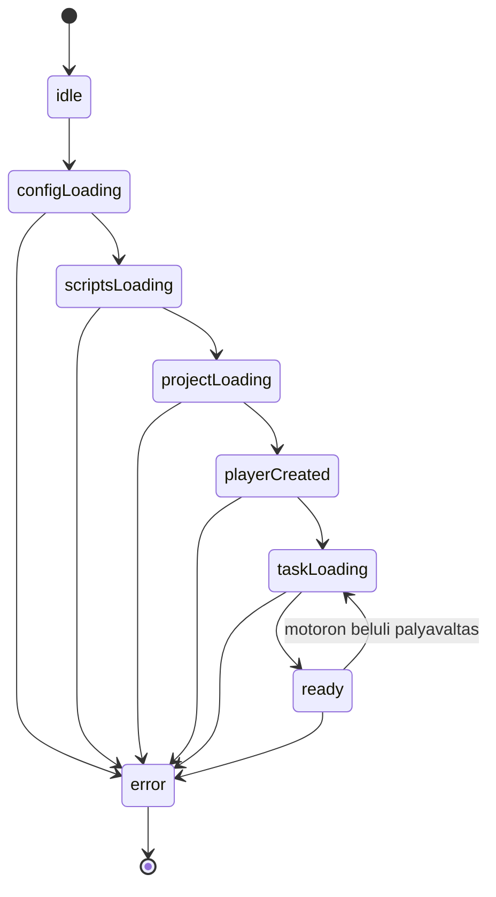

# Parcel POC: iframe nélküli feladatkeret

## Állapot és cél

Ez a dokumentum a jelenlegi POC architektúráját és fennmaradó ellenőrzési feladatait tartalmazza. A keret implementált; a futtatási parancsok a [README.md](README.md) dokumentumban szerepelnek. A tesztterv nem jelenti minden eszköz és feladattípus igazolt támogatását.

## Megvalósult szerkezet és eltérések

Az új forrásstruktúra feladatonként külön asseteket tartalmaz:

```text
lessons/
  lib/
  1710/
    1710/
    tracksjs/
    images_ms/
index.html
package.json
package-lock.json
app.webmanifest
assets/
public/shell-config.json
src/config.js
src/lesson-loader.js
src/readiness.js
src/layout.js
src/main.js
src/fullscreen.js
src/shell.css
src/compatibility.css
scripts/assets.mjs
scripts/build.mjs
scripts/server.mjs
scripts/production-app.mjs
scripts/production-server.mjs
scripts/generate-icons.mjs
Procfile
project.toml
tests/
playwright.config.mjs
```

A következő specifikációs részleteket ez a szerződés pontosítja:

- A közös forrás `lessons/lib/`, a feladat belépőscriptje `/lessons/1710/1710/index.js`.
- A `/lessons/1710/lib/` virtuális útvonal a közös könyvtárra mutat. A motor ezen keresztül számolja a feladatonkénti `tracksjs` és `images_ms` helyét, forrásmódosítás nélkül. Statikus buildben ezt feladatonként generált másolat biztosítja.
- A konfigurációvalidáció és URL-képzés a `src/config.js`, a fullscreen-kezelés a `src/fullscreen.js` része; a `main.js` kapcsolja össze őket. A dev és preview a `scripts/server.mjs` modult használja, a production külön szerver.
- Éles futtatáshoz külön `scripts/production-app.mjs` és `scripts/production-server.mjs` készült. Az `npm start` csak a kész buildet szolgálja ki Expressből, Parcel és Nginx nélkül. A build `pack build okosdoboz --builder heroku/builder:24` paranccsal készül, Node.js 24-et és a `Procfile` web folyamatát használva. A Kubernetes portja továbbra is 8080; a részletes indítási, buildpack-ellenőrzési és cache-szerződés a README-ben szerepel.
- A forrásból hiányzó MathJax fájlokat a kompatibilis 2.7.9-es npm-csomag pótolja; az ismert ReDoS-kockázatot a README dokumentálja. Nem történt legacy függőségfrissítés.
- A dev és preview gyökérútvonalú keretet szolgál ki. Külön keret-almappás telepítés még nem implementált; az assetprefix alkönyvtáras értéke viszont böngészőben ellenőrzött.
- A tényleges Heroku pack-build és 16 Node-teszt sikeres; read-only, nem root image-indítás és HTTP smoke teszt is történt. Hat Playwright-teszt van a forrásban, a teljes CLI-suite futása a korábbi környezetben hiányzó Linux-függőségek miatt nem igazolt. Korábbi integrált böngészős próbában a 1710 mind a hat pályája végigjátszható volt; valódi mobil/iPhone és további feladattípusok vizsgálata még szükséges.

Az alábbi fejezetek az implementált viselkedést írják le; a külön jelzett jövőbeli lehetőségek még nincsenek a kódban.

A cél egy Parcel 2 alapú, reszponzív keret, amely azonos originről betölt egy meglévő Okosdoboz-feladatot a saját dokumentumába, iframe nélkül. Egy teljes oldalbetöltés egy aktív feladatot jelenít meg. Másik feladatra teljes oldalnavigációval váltunk; a motoron belüli pályaváltás megmarad.

A konzervatív megközelítés határai:

- A feladatok, a motor és a meglévő függőségek forrása és verziója változatlan.
- Csak az új keretet, betöltőadaptert, kompatibilitási CSS-t és kiszolgálási eszközöket fejlesztjük.
- Nem cserélünk le motorfüggvényeket, nem nullázzuk a motor globális állapotát, és nem indítunk részleges újrainicializálást.
- Nincs iframe, Shadow DOM, SPA-feladatcsere vagy több párhuzamos lejátszó.
- A keret és a kezelősáv reszponzív; a feladattér a motor meglévő arányos skálázását használja.

A „tetszőleges feladat” az itt megismert carco/Okosdoboz csomagolási szerződésnek megfelelő feladatot jelenti, nem tetszőleges idegen HTML-alkalmazást. Jelenleg a 1710-es feladat áll rendelkezésre; más feladatok kompatibilitását további mintákkal kell igazolni.

## Meglévő integrációs pontok

| Forrás | A terv szempontjából fontos működés |
| --- | --- |
| [lessons/1710/1710/index.html](lessons/1710/1710/index.html) | Eredeti indítási sorrend: bootstrap, közös felhasználói konfiguráció, feladatazonosító, majd `loadProjects` és `createPlayer`. |
| [lessons/1710/1710/index.js](lessons/1710/1710/index.js) | Beállítja a `carco.data.okosdoboz.id` értékét. |
| [lessons/lib/okosdoboz.js](lessons/lib/okosdoboz.js) | A bootstrap script `name`, `project`, `lib` attribútumaiból indul; dinamikusan tölt további fájlokat. |
| [lessons/lib/config.js](lessons/lib/config.js) | A konfigurációt és a lejátszót választja; a dokumentum query paraméterei felülírhatnak beállításokat. |
| [lessons/lib/configs/default/config_user.js](lessons/lib/configs/default/config_user.js) | `createPlayer()` az `odPlayer` elembe építkezik, visszaadja a gyökérelemet, és beállítja a `window.drwmsg` referenciát. |
| [lessons/lib/carco_functions.js](lessons/lib/carco_functions.js) | `player.get`, `root.init`, `resizeplayer`, skálázás, aszinkron pályabetöltés és a betöltési réteg kezelése. |
| [lessons/lib/player.css](lessons/lib/player.css) | Fix fejlécek, kezelősáv és túlcsordulást elrejtő konténerek. |
| [lessons/lib/players/default/fullscreenbody.css](lessons/lib/players/default/fullscreenbody.css) | Dokumentumszintű 750 px minimumszélesség és globális stílusok. |
| [lessons/lib/carco_drag.js](lessons/lib/carco_drag.js) | Koordinátakezelés és görgetéskompenzáció; regressziós vizsgálati alap. |

A konfiguráció a bootstrap `lib` útvonalából számítja az assetgyökeret: `hosts[currentHost] + "../"`. A feladatonkénti virtuális `lib` útvonal miatt ez a `/lessons/<ID>/` mappára mutat, ahol a `tracksjs`, `images_ms` és az eredeti `<ID>/` belépőkönyvtár található.

## Könyvtárstruktúra

A legacy források a `lessons/` alatt maradnak. A keret teljes tartalma a repository gyökerébe került; minden npm-parancs innen fut:

```text
4kids/
  README.md
  parcel-poc.md
  Procfile
  project.toml
  lessons/
    lib/                        eredeti motor és függőségek
    1710/
      1710/                     eredeti feladatbelépő és XML-ek
      tracksjs/                 feladatadatok
      images_ms/                feladatképek
  index.html
  package.json
  package-lock.json
  app.webmanifest
  playwright.config.mjs
  assets/
  public/
    shell-config.json
  src/
    main.js
    config.js
    lesson-loader.js
    readiness.js
    layout.js
    fullscreen.js
    shell.css
    compatibility.css
  scripts/
    assets.mjs
    build.mjs
    server.mjs
    production-app.mjs
    production-server.mjs
    generate-icons.mjs
  tests/
  dist/                         generált, nem verziózott
```

A generált `dist`, `.parcel-cache`, `node_modules`, `test-results` és `playwright-report` könyvtárak nem kerülnek Gitbe. A forrásokat nem költöztetjük át, és nem hozunk létre kézzel karbantartott legacy másolatot.

## URL- és prefixszerződés

Az alapértelmezett `lessonsPrefix` értéke `/lessons`. Példa ugyanazon origin alatt:

```text
/?lesson=1710                       az új keret a kiválasztott feladattal
/shell-config.json                  a keret konfigurációja
/lessons/1710/1710/index.js          a feladat azonosítójának scriptje
/lessons/1710/1710/index.html        megőrzött eredeti HTML (nem keretbelépő)
/lessons/lib/okosdoboz.js            bootstrap
/lessons/lib/odconfig_user.js        közös felhasználói konfiguráció
/lessons/lib/...                    további változatlan motorfájlok
/lessons/1710/lib/...               virtuális könyvtáralias
/lessons/1710/tracksjs/...           pálya- és feladatadatok
/lessons/1710/images_ms/...          képek
/lessons/1710/images_ms/half/...     félméretű képek
```

**A `/lessons/1710` a feladatcsomag helye, nem a keret route-ja.** A keret a `/lessons/1710/1710/index.js` scriptet tölti be, nem a teljes HTML-t. Az eredeti HTML fájl megmaradt, de relatív `../lib/` hivatkozása ezen az útvonalon nem a feladatonkénti virtuális `lib` aliasra mutat; önálló működését a jelenlegi keret nem garantálja.

A prefix lehet például `/content/lessons` is. Ez az assetek mountja, nem a keret telepítési base pathja. A jelenlegi dev/preview/production kiszolgálók a keretet az origin gyökerében szolgálják ki; `/app/` alatti kerettelepítés nincs implementálva. A kliens konfigurációs fetch a dokumentum mappájához viszonyított.

A keret bootstrap-URL-jeit a [src/config.js](src/config.js) `lessonUrls()` függvénye készíti `URL` API-val; a további URL-eket a legacy motor számolja. A `lib` attribútum gyökérhez viszonyított pathname, például `/lessons/1710/lib/`, nem teljes HTTPS-URL, mert azt a motor képi normalizálója hibásan kezelné. Nincs külön `urls.js` modul vagy globális `<base>` elem.

## Konfiguráció

A [public/shell-config.json](public/shell-config.json) jelenlegi konfigurációja:

```json
{
  "lessonsPrefix": "/lessons",
  "defaultLessonId": "1710",
  "supportedLessonIds": ["1710"],
  "loadTimeoutMs": 30000
}
```

| Kulcs | Szerződés |
| --- | --- |
| `lessonsPrefix` | Azonos originű, gyökérhez viszonyított útvonal vagy azonos originű abszolút HTTP(S) URL. Normalizált könyvtár-URL lesz belőle. |
| `defaultLessonId` | A queryből hiányzó feladat alapértéke; szerepelnie kell a támogatott listában. |
| `supportedLessonIds` | Nem üres, egyedi, támogatott azonosítók listája. Csomagolási és kompatibilitási manifest, nem biztonsági sandbox. |
| `loadTimeoutMs` | Pozitív egész időkorlát; a POC-ban 1000 és 120000 ms között engedélyezett. |

A feladatválasztás `?lesson=1710` alapján történik, hiányzó paraméternél az alapértékkel. Az ID karakterlánc, 1–12 számjegy, pozitív és vezető nulla nélküli. Üres, duplikált, hibás vagy a manifestből hiányzó ID hibát eredményez a bootstrap előtt. Nem szűkítjük az adaptert egy 1710-re írt feltételre.

A POC csak a `lesson` query kulcsot fogadja el. Az `id`, `config`, `player`, `currentgame`, `currenttrack`, `playersize`, `datatype` és minden más kulcs elutasítandó. A motor is feldolgozza a `window.location.search` értékét; ezzel megakadályozzuk a keret választásának véletlen felülírását. Nem írjuk át észrevétlenül az URL-t History API-val.

Prefixvalidáció még URL-normalizálás előtt is szükséges. Elutasítandó a cross-origin vagy protokollrelatív URL, credentials, query/hash, visszaperjel, pontszegmens, útvonalbejárás és kódolt szeparátor. A POC egyszerű szabályaként a prefixben százalékosan kódolt szegmens sem engedélyezett. A puszta `/` nem használható mountként. A prefixben és a feladatazonosítóban nincs tetszőleges felhasználói script-URL.

A JSON HTTP-hibája, hibás formátuma, ismeretlen kulcsa vagy hiányzó kötelező mezője kontrollált konfigurációs hibát ad. A konfiguráció lekérése `cache: "no-store"` beállítással történik. A build és a kiszolgáló ugyanazokat a validációs szabályokat használja; a same-origin ellenőrzés futáskor a tényleges originhez kötött.

Új feladat hozzáadásakor az eredeti csomagot és kapcsolódó közös asseteket kell elhelyezni, majd a manifestet bővíteni. Ez buildkonfigurációs változás, nem adapterkód-módosítás.

## Modulok és felelősségek

| Implementált modul | Feladat |
| --- | --- |
| `main.js` | Egyszeri indítás, állapotok és magyar loading/error megjelenítés; a modulok összekapcsolása. |
| `config.js` | Konfiguráció, feladatválasztás, prefixnormalizálás és bootstrap URL-képzés. |
| `lesson-loader.js` | Klasszikus scriptek szekvenciális betöltése, `loadProjects` és `createPlayer` egyszeri meghívása. |
| `readiness.js` | A motor DOM- és adatállapotának megfigyelése, készültség és időkorlát. |
| `layout.js` | Konténer- és kezelősávmérés, legacy resize-csatorna és magasságkorrekció. |
| `fullscreen.js` | Felhasználói műveletre induló Fullscreen API és fallback. |
| `shell.css` | A keret saját elrendezése és állapotai. |
| `compatibility.css` | Kizárólag a keretoldalra szűkített legacy stílusfelülírások. |

A tényleges adapterfelület `startLesson(urls, lessonId, signal, onState)`. A Promise a `createPlayer()` után a gyökeret adja vissza, még nem a teljes pálya készültségét. Ezt külön `waitForTask(root, lessonId, signal)` ellenőrzi. Egy oldalon egy indítási Promise létezik; azonos ID ugyanazt kapja vissza, másik ID hiba. Az `odPlayer` a HTML-ben létezik, nem argumentumban átadott tetszőleges konténer.

A megfigyelők saját cleanup művelete leállítja a keret figyelőit és időzítőit. **Ez nem a motor unmountja**, és nem teszi lehetővé egy második runtime indítását.

## Indítási állapotgép



### Bootstrap lépései

1. A dokumentum készültségének és a konfigurációnak ellenőrzése; egyetlen `div#odPlayer` a normál DOM-ban. A body saját `parcel-lesson-shell` osztályt kap.
2. Az `odPlayer` indulás előtt `playersize="embedded"` attribútumot kap. Ez nem új regisztrált lejátszó, csak a meglévő parser által átadott nem-`fullscreen` érték; a viewport-beavatkozást elkerülő ág működését tesztelni kell.
3. A bootstrap betöltése: `src` a prefix alatti `lib/okosdoboz.js`, attribútumok `name="carco"`, `project="okosdoboz"`, `lib` a prefix alatti közös könyvtár. Az attribútumok a DOM-ba helyezés előtt kerülnek a scriptre.
4. Az eredeti sorrendben a `lib/odconfig_user.js`, majd a kiválasztott feladat `index.js` fájljának betöltése. Minden script külön `load`/`error` kezeléssel és időkorláttal fut, nem ESM-importként.
5. A script által beállított `carco.data.okosdoboz.id` egyezésének ellenőrzése a kiválasztott ID-vel; szükséges névterek ellenőrzése.
6. `carco.functions.loadProjects(callback)` pontosan egyszer. A callbackben a `createPlayer()` egyszeri hívása és visszatérési gyökerének megtartása.
7. A kompatibilitási stylesheet elhelyezése és betöltésének megvárása. Az eredeti fejléc és kezelősáv DOM-elemeinek mozgatása a `controls` oldalsávba, meglévő eseménykezelőikkel együtt. Külön computed-style startup-validáció nincs.
8. Layout- és készültségfigyelők indítása. A projektcallback csak strukturális készültség, nem bizonyítja az aszinkron pálya és képek befejezését. A `body.dataset.state` tényleges értékei `scripts-loading`, `project-loading`, `player-created`, `task-loading`, `ready`, `error`; a diagram konfigurációs szakasza konceptuális, nem mindegyik külön kódolt állapot.

Nem másoljuk át az eredeti `window.onload` hozzárendelést, nem használunk jQuery `.load()`, `innerHTML`-es scriptindítást vagy `eval` hívást. A motor tölti a saját jQuery/CreateJS/MathJax függőségeit; ezeket a keret nem tölti be másodszor.

Az időkorlát a scriptindítástól az első feladat készültségéig tart; későbbi pályaváltás új, ugyanilyen korlátos várakozást kap. Hiba után a későn érkező callback nem indíthat lejátszót és nem változtathatja az állapotot `ready`-re.

## A feladat készültsége

A motor `afterPreload` útvonala létrehozza a feladat gyermekeit, majd időzítve elrejti a `playeritems.preload_layer` elemet. Ez megfigyelhető, de **a betöltési réteg rejtett állapota önmagában nem elég**.

A készültségfigyelő azonnal kiértékeli az állapotot, majd `MutationObserver` segítségével követi a feladat DOM-ját és a betöltési réteget. A feltételek együtt szükségesek:

- Az aktuális játékazonosító a kért feladaté.
- Az aktuális pálya és hozzá tartozó adatok elérhetők.
- A gyökérben a feladat renderelt gyermekei megjelentek.
- A feladattér mérete pozitív.
- A kezdeti betöltés és feladatépítés bizonyítéka mellett a preload réteg rejtett.
- A `waitForTask` többszöri mintában azonos pozitív geometriát vár (`stable >= 2`). Látható lapon animation frame, háttérben 100 ms-os timer ütemez. A teljes assetkészültséget és egy korábbi preload-megjelenést nem igazolja külön.

A megfigyelő ne kizárólag egy később elkapott eseményre várjon: gyors betöltésnél már meglévő adatokat és DOM-ot is ellenőriznie kell. Későbbi pályaváltásnál a motor által megjelenített preload réteg alapján loading állapotba térhet vissza, új `createPlayer` nélkül.

Nem hívjuk újra a `root.carco.load("server", callback)` függvényt csak egy készültségi callbackért, és nem cseréljük le a motor callbackjeit. A canvas tényleges tartalmának és a képek betöltésének helyessége külön böngészős ellenőrzés: a DOM-készültségi jel nem bizonyítja önmagában az összes asset sikerét.

## Reszponzív layout

A motor saját játéktérméretezése megmarad. A teljes lejátszót nem kényszerítjük 7:3 arányra, és nem skálázzuk CSS-transzformációval. A 3150 × 1350-es logikai tér arányos megjelenítéséért továbbra is a motor felel.

A kompatibilitási CSS a keret body-jára, `#odPlayer`-re és `#controls`-ra céloz. Bal oldalon a játéktér, jobb oldalon görgethető cím/instrukció/vezérlősáv található. A meglévő gombokat áthelyezzük, nem másoljuk. A 600 px-nél nem szélesebb portrait viewport elfordítási jelzést kap; a háttérkeret `inert`, a feladat betöltve marad. Popupok fixed pozícióval, viewportmagasság-korláttal és külön görgetéssel jelennek meg.

### Méretezési ciklus

1. Valódi konténerszélesség-változásnál a keret a meglévő ablak-`resize` csatornát működteti. A motor saját `resizeEnd` pluginja végzi a gyermekek késleltetett átméretezését.
2. A `layout.js` a konténer szélességéből és magasságából számítja az `odPlayer` szélességét: `min(width - 8, (height - 14) * 3150 / 1350)`, minimum 1 px. A motor resize-kezelője számítja a feladattér magasságát.
3. A külső player és belső wrapper magassága a játéktér mért magasságát követi. A fejléc nem része ennek, mert az oldalsávban van. A motor fix 106 px többletét ez a DOM-korrekció ellensúlyozza, nem motorfüggvény-csere.
4. A betöltési réteg pozícióját a játéktér és a tényleges pozicionáló ős téglalapjából kell korrigálni; a motor fix 108/51 px-es top feltételezése újratördelt fejlécnél nem elegendő.
5. A magasságot az információs rétegek és pályaváltások után is ellenőrizzük. Magas információs tartalomnál görgetés maradjon lehetséges.

`ResizeObserver` a konténert és játéktérszülőt figyeli; `MutationObserver` a player és oldalsáv style/class/gyermekváltozásait. Összevont frame/timer ütemezés és 1 px-es geometriai tolerancia akadályozza a redundáns írásokat. A main háttérben ritka viewport-ellenőrzést is végez.

Nem feltételezünk `root.carco.resizeEnd()` API-t. A már regisztrált event listener az eredeti függvényreferenciát tartja; a `resizeplayer` property lecserélése nem cserélné le automatikusan a listenert. Ezért a POC nem írja felül a metódust.

**Döntési kapu:** ha a kezelősáv vagy koordináták korrekciója csak motorfüggvények lecserélésével oldható meg, a POC ezt inkompatibilitásként dokumentálja és külön jóváhagyást kér. Nem bővül észrevétlenül motorátírássá.

## Fejlesztői kiszolgálás

Parcel kizárólag a keret HTML-belépési pontját és új moduljait dolgozza fel. Nem követjük Parcel HTML-függőségként a legacy feladat belépési pontját, és nem hash-eljük át a motor dinamikus fájlneveit.

A [scripts/server.mjs](scripts/server.mjs) fejlesztői ága egy origin alá egyesíti a keretet és az asseteket:

- Parcel belső, loopback porton fut, az új keret buildjét készíti.
- A külső fejlesztői szerver például a 3000-es porton érhető el; a port konfigurálható.
- A konfigurációt és a prefix alatti legacy fájlokat közvetlenül szolgálja ki a forrásból.
- A keret HTTP-kéréseit Parcelhez proxyzza, és a HMR WebSocket kapcsolatot is ugyanazon origin alatt kezeli.
- Foglalt portnál érthető hibát ad; nem állít le meglévő folyamatot.

A dev szerver Express static middleware-t és http-proxy könyvtárat használ. A statikus útvonalkezelést Express biztosítja; külön canonical realpath/symlink-ellenőrzés nincs implementálva. Csak megbízható forráskönyvtárat használjunk.

A prefix teljes útvonalszegmens: `/lessonsx` nem `/lessons` alatti kérés. Hiányzó legacy fájl valódi 404-et ad, **nem keret-HTML fallbacket**. Statikus útvonalon csak GET/HEAD támogatott. A feladatkönyvtár eredeti indexoldalára a szokásos directory index/redirect szabály vonatkozik.

Az alapértelmezett forrásgyökér a repository `lessons/` mappája. Opcionális `LESSONS_SOURCE_DIR` másik, azonos szerkezetű forrásgyökeret jelölhet; ez szerveroldali konfiguráció.

## Build és éles telepítés

A [scripts/build.mjs](scripts/build.mjs) tényleges lépései:

1. Konfiguráció és célútvonalak ellenőrzése.
2. Parcel production build a keret `dist/` könyvtárába.
3. A manifestben szereplő feladatmappák, közös `lib` és feladatonkénti aliasmásolatok másolása; a hiányzó MathJax fájlok kiegészítése a telepített 2.7.9-es csomagból.
4. A normalizált konfiguráció kiírása a build mellé. A prefix környezeti felülírása és normalizálása miatt ez nem bájtazonos másolata a forrás JSON-nak.
5. A SHA-256 összevetés az `npm test` része, nem az önálló buildscripté. Heroku CNB alatt a `heroku-postbuild` futtatja a teszteket. A build előbb törli és újraépíti a gyökér `dist/` mappát.

A másolás strukturált fájlrendszer-API-val történik; nem másolja a teljes repót, `.git` vagy `node_modules` tartalmat. Nem ír a forrásokba, és nem töröl az ellenőrzött outputgyökéren kívül. A MathJax és a képek teljes relatív hierarchiája megmarad.

Gyökérbe telepítésnél például:

```text
dist/
  index.html
  shell-config.json
  assets...                     Parcel által generált keretfájlok
  lessons/
    lib/
    1710/
      1710/
      tracksjs/
      images_ms/
      lib/                      generált aliasmásolat
```

A runtime konfiguráció prefixe és a generált mount helye összetartozik. **A JSON prefixének átírása önmagában nem mozgatja át az asseteket.** Új prefixhez újracsomagolás vagy az éles szerver mountjának átállítása is szükséges.

Almappás assetprefix támogatott; külön `/app/` alatti keret-base-path és külső assetmód nem implementált. A jelenlegi szerver gyökérútvonalas kerettel működik.

A POC alapértelmezése a kezelt, automatikus legacy másolás. Már meglévő same-origin assetkiszolgálásra később külön, explicit külső-asset mód készülhet; ez nem szükséges az első működő próbához.

A [package.json](package.json) működő parancsai `start`, `dev`, `build`, `preview`, `test`, `test:e2e`, `heroku-postbuild`. Node `24.x`, lockfile-os npm telepítés és [project.toml](project.toml) alapú Heroku builder használatos. A [Procfile](Procfile) web folyamata közvetlenül a production Node-szervert indítja. Csak Express runtime dependency; a többi keretfüggőség build/dev. A kész image-ben megmaradó forrásfájlok mennyiségét a buildpack határozza meg, nincs többfázisú Dockerfile-os runtime-válogatás.

A production app induláskor ellenőrzi a build konfigurációját, indexoldalát és támogatott feladatbelépőit. GET/HEAD kiszolgálás, valódi 404, `nosniff`/Referrer-Policy, konfigurációra `no-store`, HTML/manifest/legacy fájlokra `no-cache`, kizárólag gyökérbeli hash-elt assetekre immutable cache. SIGTERM/SIGINT leállítás legfeljebb 10 másodperc. A 8080-as port és `/shell-config.json` probe a Kubernetes manifesttel egyezik; read-only, nem root buildpack-indítás helyben ellenőrzött.

A visszaállított [k8s/deployment.yaml](k8s/deployment.yaml) ugyanakkor rögzített 101-es UID/GID-val, 32 MiB memóriarequesttel és 128 MiB limittel működik, `readOnlyRootFilesystem` nélkül. A helyi buildpack-próba a run image saját felhasználóját használta. Ezért a régi manifest és az új buildpack-image kompatibilitása még külön ellenőrzendő; a sikeres helyi tesztet nem tekintjük klaszterbeli rollout-igazolásnak. A jelenlegi konfiguráció részletei a README Kubernetes-fejezetében szerepelnek.

## Hibakezelés, fullscreen és biztonság

A keret magyar loading státuszt és konkrét hibát jelenít meg, `aria-live` állapottal. A hiba szövege `textContent` útján kerül a DOM-ba. Példa hibakategóriák: konfiguráció, ismeretlen feladat, scriptbetöltés, azonosítóeltérés, projektbetöltési időkorlát, feladatkészültségi időkorlát, nem támogatott motorfelület.

Hibás vagy lejárt indítás lezárt állapot. Újrapróbálás csak teljes oldalreload, nem ugyanabban a dokumentumban végzett remount. A keret megszakítja saját fetch-eit és figyelőit; egy script elem eltávolítása nem garantálja a motor összes későbbi kérésének megszakítását. A későn befejeződő callbackeket ezért is védeni kell.

A fullscreen célpont a `document.documentElement`, standard vagy WebKit API-val és 2500 ms időkorláttal. Nem támogatott/letiltott/megtagadott kérésnél a CSS fallback 64 px-re csukja az oldalsávot; a visszagomb megmarad. Ez nem rejti el a Safari címsorát. Kezdőképernyős standalone indításhoz manifest és Apple metaadatok vannak; külön service worker/offline mód nincs. Standalone állapotban a gomb csak a játéknagyítást kezeli. Valódi iPhone-os ellenőrzés szükséges.

A motor küldhet `gyakorloEredmeny`, `tudasprobaEredmeny` és `escPressed` üzeneteket, de a keret jelenleg nem fogyasztja ezeket és nem ment eredményt backendbe. Későbbi fogyasztónál origin/source és payload validáció szükséges; ez jelenleg jövőbeli követelmény, nem kész integráció.

**Azonos origin nem sandbox.** Csak megbízható feladatcsomag tölthető be, mert a legacy script hozzáfér a keret teljes dokumentumához. A prefixvalidáció útvonalvédelmet ad, nem izolációt. A keret nem lazít CSP-t és nem vezet be `eval`-t; a régi motor esetleges CSP-követelményeit külön kompatibilitási feltételként kell vizsgálni.

## Eredeti implementációs ütemezés

Az alábbi történeti ütemezés már részben megvalósult. Az aktuális készültséget a dokumentum eleje és a következő ellenőrzési fejezet rögzíti, nem az egykori belépési feltételek.

| Lépés | Eredmény | Belépési/ellenőrzési feltétel |
| --- | --- | --- |
| 0. Dokumentáció | Ez a specifikáció és README-hivatkozás | Csak dokumentációváltozás, érvényes helyi linkek. |
| 1. Konfiguráció és URL-ek | Validált prefix/ID, központi URL-képzés | Node unit tesztek: jó/hibás prefixek és queryütközések. |
| 2. Parcel és csomagolás | Same-origin dev, build és preview | A dinamikus legacy URL-ek működnek, másolati hash-ek egyeznek. |
| 3. Minimális bootstrap | Egy valódi 1710-es feladat, egyszeri init | Renderelt feladat, helyes ID, készültségjel; nincs iframe. |
| 4. Reszponzív adapter | Újratördelt kezelősáv, stabil magasság | 390 px és konténer-only resize; nincs koordinátahiba vagy resize-hurok. |
| 5. Fullscreen és hibák | Helyreállítható oldalreload, API/fallback | Időkorlátok és késői callbackek nem indítanak új lejátszót. |
| 6. Elfogadás | Dev/production és prefixmátrix | Az alábbi feltételek teljesülnek; források változatlanok. |

A másolási előkészítés és a konfiguráció unit tesztjei párhuzamosan végezhetők. A layout véglegesítése csak működő bootstrap után kezdődik. Minden kisebb implementációs lépést a legszűkebb releváns teszt követ; a sikeres asztali kép nem helyettesíti a mobilos interakcióvizsgálatot.

## Tesztterv és elfogadási feltételek

### Unit és csomagolási tesztek

- Prefix: `/lessons`, záró perjel, `/content/lessons`, azonos originű URL; tiltott cross-origin, credentials, traversal és kódolt szeparátor.
- ID: alapérték, manifestbeli másik ID, üres/duplikált/hibás paraméter, nem támogatott és túl hosszú azonosító.
- Queryütközések: a motor rezervált paraméterei bootstrap előtti hibát adnak.
- URL-képzés: külön feladat- és közös könyvtárútvonalak, helyes `lib` attribútum.
- Betöltő: szekvenciális scriptindítás, egyszeri `loadProjects`/`createPlayer`, ismételt indítási védelem, timeout és késői callback.
- Csomagolás: csak kijelölt mappák, teljes közös hierarchia, változatlan SHA-256, outputgyökéren kívül nincs írás/törlés.

### Valódi böngészős próba

1. Egyetlen `odPlayer`, nulla iframe és shadow gyökér; a kért ID a motorban is egyezik.
2. A bootstrap klasszikus script attribútumai megmaradnak; a régi jQuery/pluginok működnek, a keret nem írja felül őket.
3. A ready állapot tényleges feladatépítés után jelenik meg; canvas pixelvizsgálat és képernyőkép igazolja a nem üres tartalmat.
4. A 1710 minden pályája használható: választás, ellenőrzés, megoldás, tovább, újraindítás, info és eredmény. A véletlen pályasorrend miatt nem feltételezünk fix sorrendet.
5. 320, 390, 750, 768, 1024 és 1440 px; álló/fekvő mobil és keskeny asztali konténer. Nincs levágott kezelősáv vagy dokumentumoldali vízszintes overflow.
6. Konténer-only resize, font-/assetkészültség, pályaváltás és fullscreen után helyes geometria; a feladatállapot megmarad, a méretfrissítés stabilizálódik.
7. Egér és touch találati koordináták, görgetés, fókusz és billentyűkezelés helyes; valódi mobilpróba is szükséges.
8. `/lessons` és `/content/lessons` assetprefix vizsgálata. Almappás kerettelepítés külön fejlesztési feladat, nem a jelenlegi implementáció állítása.
9. Hiányzó asset valódi 404; nincs HTML-t scriptként visszaadó fallback, mixed content vagy indokolatlan legacy külső host kérés.
10. Hibás konfiguráció, script/project/task timeout és késői callback kontrollált hibát ad dupla inicializálás nélkül.
11. Natív fullscreen és fallback működik, Escape kezelése egyszeri, a feladatállapot nem vész el.
12. A legacy források és csomagolt másolatok hash-e egyezik; nincs motor- vagy feladatforrás-diff.

A 1710-es feladat nem bizonyítja az összes feladattípus támogatását. A build és 16 Node-teszt, pack image-indítás, HTTP- és korábbi integrált böngészős próbák sikeresek. A hat Playwright-teszt teljes CLI-futása és a valódi mobil/iPhone-mátrix nem igazolt. A fenti lista ellenőrzési terv, nem minden pontjában teljesített suite.

## Kilépési és döntési pontok

A POC akkor sikeres, ha változatlan legacy forrásokkal egy feladat ténylegesen működik ugyanabban a dokumentumban, konfigurálható prefixről, mobilon használható kezelősávval és stabil méretezéssel, dev és éles buildben is.

Ha metóduscsere, globális állapot-visszaállítás vagy feladatspecifikus kódág kell, azt inkompatibilitásként dokumentáljuk. A következő döntés lehet szűkített támogatási szerződés, közös motoradaptáció vagy külön iframe-es kontroll; egyik sem automatikus része ennek a tervnek.

Nem cél a szöveg teljes újratördelése, backend/LMS-integráció, legacy függőségfrissítés vagy a nyilvános portál újraépítése. A feladat szövege nagyon keskeny képernyőn arányos skálázással továbbra is kicsi lehet.

## Források

- [Parcel HTML-feldolgozás](https://parceljs.org/languages/html/): miért csak a keret legyen build-belépési pont.
- [Parcel dependency resolution](https://parceljs.org/features/dependency-resolution/): URL-ek és függőségfeldolgozás.
- [README.md](README.md): az általános felmérés és az alternatív megközelítések.